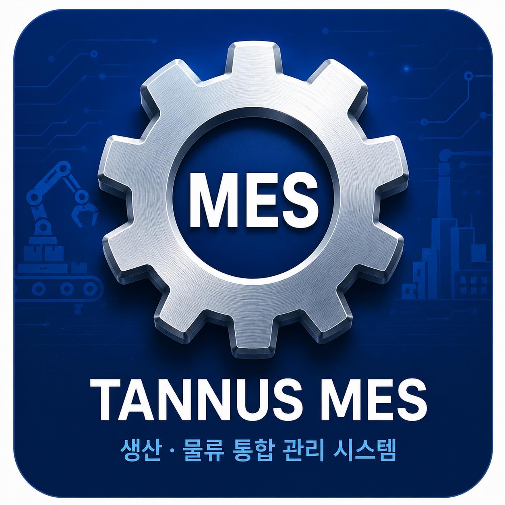

# Tannus MES

## 프로젝트 소개

Tannus MES는 생산, 물류, 포장, 출고, 입고 과정을 통합 관리하는 MES 기반 웹 시스템입니다.

## 주요 기능

- 포장 지시 및 포장 완료 처리
- 출고 지시 및 출고 완료 처리
- QR 스캔 기반 실시간 작업 처리
- 재고 조회 및 재고 히스토리 관리
- 수정 요청 승인/반려 관리
- 관리자 통계 대시보드 제공

## 기술 스택

- Java 17
- Spring Boot
- JSP / JSTL
- MyBatis
- MySQL
- Docker
- AWS EC2

## 배포 주소

http://43.203.123.217:8080
